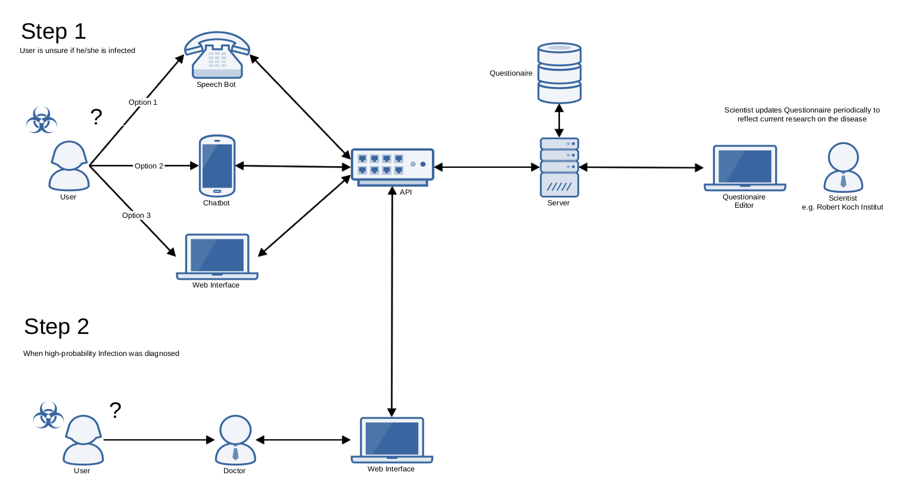

# OpenHeathCheck-Backend

### Problemstellung 

Fragebögen zum Self-Health Check sind auf wenige, meist digitale Medien begrenzt und erfordern beispielsweise einen Internetzugang. Dadurch werden bestimmte Zielgruppen von der Selbstevaluierung ausgeschlossen.

### Zielsetzung 

Wir wollen einen Self-Health Check anbieten, der einheitlich über eine Vielzahl an Medien wie Telefon, Chat, Web und App, angeboten wird.

## Beschreibung des Backends
Über einen zentralen Backend Server wird ein für alle Kanäle/Medien einheitlicher Fragebogen samt Auswertungslogik bereitgestellt. Des Weiteren werden über das Backend die beantworteten Fragen sowie die Selbstdiagnose/Zusammenfassung individuell für jeden Anwender gespeichert.

Das Backend verfügt daher über eine RESTful API (Web-basierte Schnittstelle), die den aktuellen Fragebogen in einem maschinell lesbaren Format (JSON) anbietet. Im Detail werden die Fragen einzeln als Web Ressourcen angeboten und können individuell für bzw. durch einen Anwender mit einer Antwort belegt werden. Ein "hypertext-driven" Design erzwingt die Beantwortung der einzelnen Fragen in der richtigen Reihenfolge. Vielmehr wird die Reihenfolge der Fragen innerhalb eines Fragebogens dynamisch auf Basis der bisherigen Antworten angepasst, indem ein Hyperlink, der auf die nächste zu beantwortende Frage referenziert, situationsbedingt gesetzt wird. Durch dieses Prinzip ist HATEOAS sowie ein RESTful Design der Schnittstelle gegeben. Für die Beschreibung der Schnittstelle liegt eine OpenAPI Dokumentation vor.

Der Fragenbogen inkl. Fragen und Antwortmöglichkeiten werden in einem JSON File festgelegt und im Backend gespeichert. In diesem JSON File entsteht eine Graph-ähnliche Struktur, die die möglichen, antwortabhängigen Reihenfolgen bei der Beantwortung der Fragen widerspiegelt.

## Api Documentation
See OpenApi documentation in root folder 

## Limitations of the Project
- Ids in the Backend are guessable

## Getting Started
- In `src/main/resources/application.properties` add your db credentials.
- Create db tables using db/create-db.sql
- Compile using java 13
- Find json editor at: http://localhost:8080/editor/index.html
- Find Api at: http://localhost:8080/api/v1
- Build with maven `mvn clean install`

## Deployment
Build docker container using Dockerfile:
- `docker build -t wirvsvirus-backend .`
- then: `docker container run -p 8080:8080 wirvsvirus-backend`
